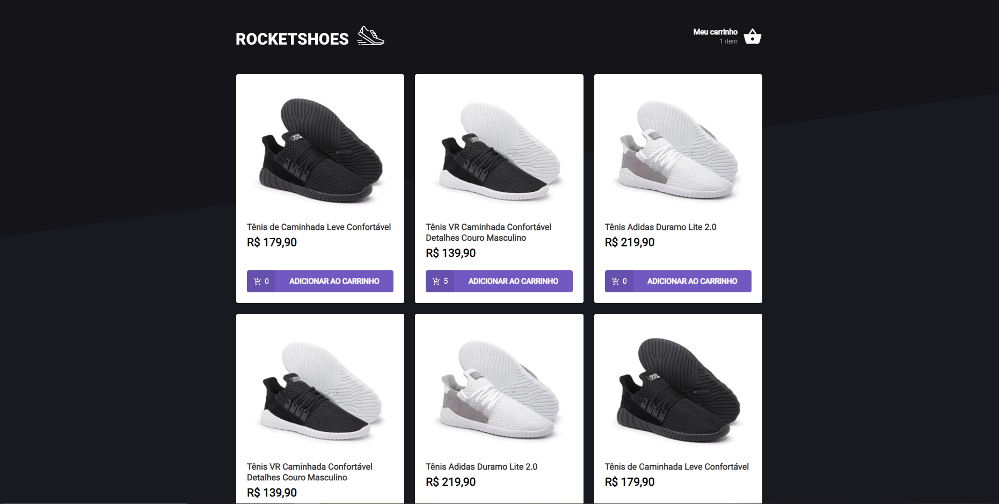

<h1 align="center">
    
</h1>

    

## :dart: Desafio do Ignite

Neste desafio o principal objetivo era a criar um hook de carrinho de compras e nele pude fixar melhor o uso da [Context API](https://reactjs.org/docs/context.html).

## :thinking: Como rodar o projeto?

1. `yarn` para instalar as dependências

2. `yarn server` para rodar a fake API feita com [JSON Server](https://github.com/typicode/json-server)

3. `yarn start` para executar a aplicação

4. `yarn test` para rodar os testes(não é necessário para rodar o projeto)
